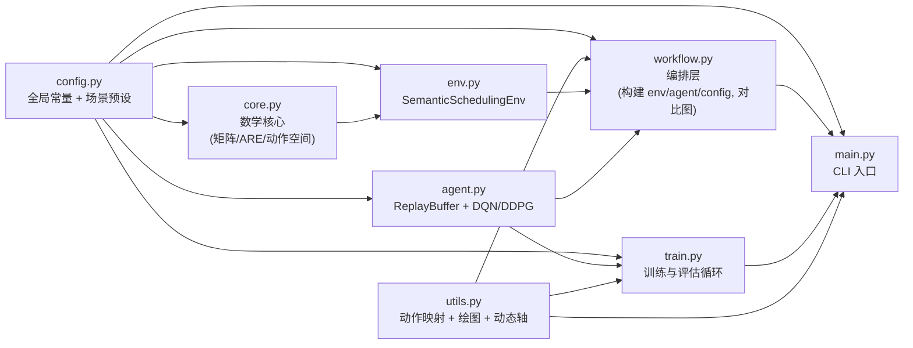
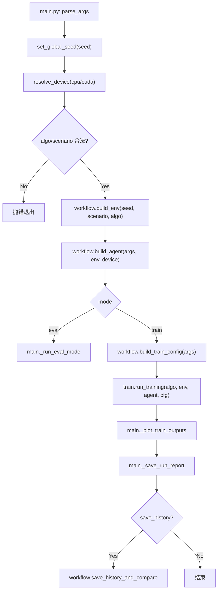
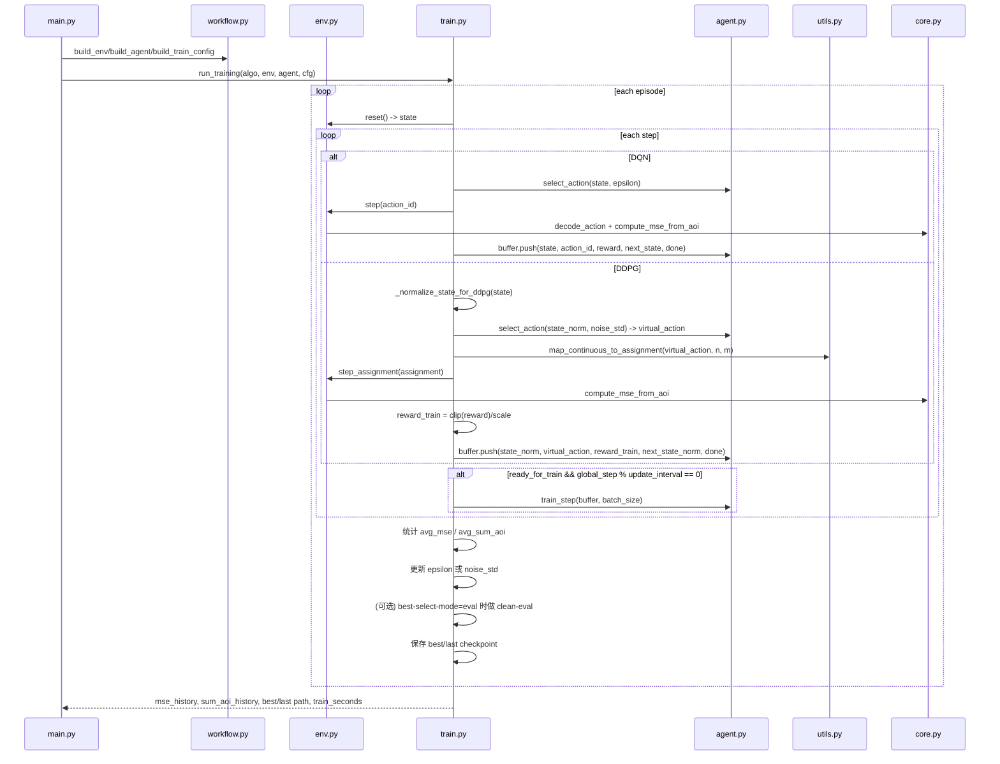
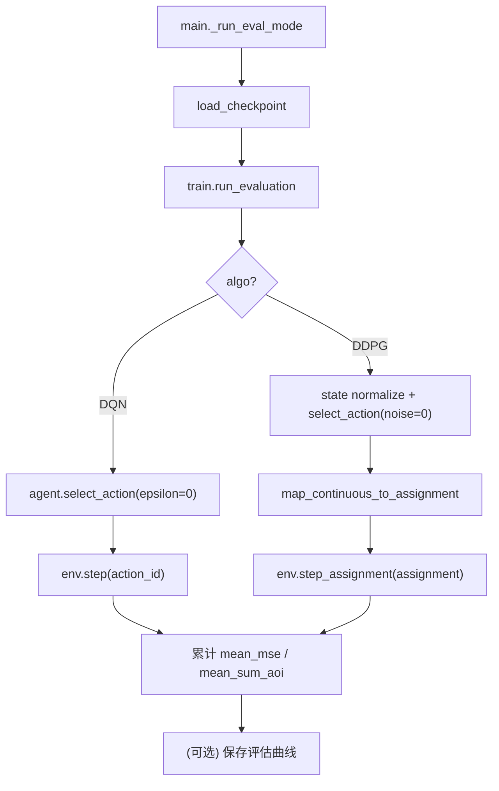

# sematic 项目代码工作流（Dataflow）

> 更新时间：基于当前代码版本（含 `scenario`、DDPG assignment 路径、动态纵轴 35%）。
> 目标：帮助你快速理解“从 CLI 到训练/评估/出图”的完整数据流。

## 1. 文件级工作流总览

## 2. 入口与编排（main + workflow）

### 2.1 CLI 入口主链

### 2.2 场景选择与限制

- `--scenario` 支持：`base`、`s10x5`、`s20x10`。
- `workflow.build_env(...)` 通过 `SCENARIO_PRESETS` 解析 `n,m`。
- `DQN` 仅允许 `base`，非 `base` 会在 `main.py` 直接拒绝。
- 环境动作空间构建策略：
  - DQN：构建离散 `action_space`。
  - DDPG：可不构建离散动作全集，走 `assignment` 接口避免组合爆炸。

## 3. 训练数据流（train.run_training）

## 4. 评估数据流（run_evaluation）

## 5. 绘图与输出工作流

### 5.1 训练展示图（动态纵轴）

- 生效范围：训练阶段 MSE 图 + SumAoI 图。
- 动态规则：
  - 基准取最后 `10%` episode 的均值（tail mean）。
  - 目标比例固定 `35%`，即 `y_max = tail_mean / 0.35`。
  - 超过上界的点做硬裁剪（hard clip）。
- 入口：`main._plot_train_outputs(...)` 调用 `utils.compute_dynamic_ylim_from_tail_mean(...)`。

### 5.2 对比图（动态纵轴）

- 生效范围：`compare_DQN_DDPG_*_mse.png` 与 `*_sumaoi.png`。
- 动态规则：
  - 先算 DQN 和 DDPG 各自最后 `10%` 的均值。
  - 取两者较大值作为对比图基准。
  - 用同一 `35%` 规则计算单一纵轴并硬裁剪。
- 入口：`workflow.save_history_and_compare(...)`。

### 5.3 不使用动态纵轴的图

- 诊断图：`raw_mse`、`log_mse`（保持原始诊断行为）。
- 评估图：保持静态/默认行为。

## 6. 关键数据格式与接口

- 环境状态：
  - `state: np.ndarray[float32], shape=(n + n*m,)`
  - 前 `n` 维是 AoI，后 `n*m` 维是离散信道索引。
- DQN 动作：
  - `action_id: int`
  - 使用 `env.step(action_id)`。
- DDPG 动作：
  - `virtual_action: np.ndarray[float32], shape=(n,)`
  - 经 `map_continuous_to_assignment` 变为 `assignment: tuple[int,...]`。
  - 使用 `env.step_assignment(assignment)`。
- 训练核心输出：
  - `mse_history: list[float]`
  - `sum_aoi_history: list[float]`
  - `best_model_path`, `last_model_path`
  - `best_metric_source`, `best_metric_value`
  - `train_seconds`

## 7. 结果文件落盘路径

- Checkpoint：
  - `results/checkpoints/{algo}_{scenario}_seed{seed}_best.pt`
  - `results/checkpoints/{algo}_{scenario}_seed{seed}_last.pt`
- 历史：
  - `results/histories/{algo}_{scenario}_seed{seed}_ep{episodes}.npz`
- 报告：
  - `results/reports/report_{algo}_{scenario}_seed{seed}_ep{episodes}.json`
- 图像：
  - 训练图：`results/result_{algo}_{scenario}_seed{seed}.png`
  - 训练 SumAoI：`results/result_{algo}_{scenario}_seed{seed}_sumaoi.png`
  - 诊断图：`results/result_{algo}_{scenario}_seed{seed}_raw_mse.png`, `..._log_mse.png`
  - 对比图：`results/compare_DQN_DDPG_{scenario}_seed{seed}_ep{episodes}_mse.png`, `..._sumaoi.png`

