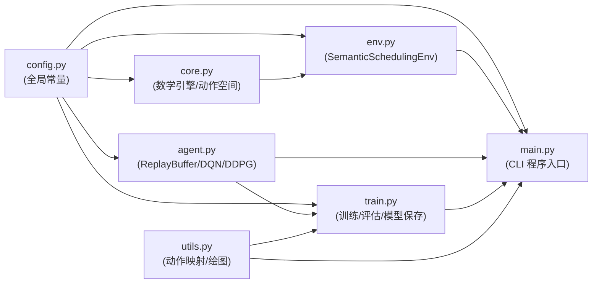
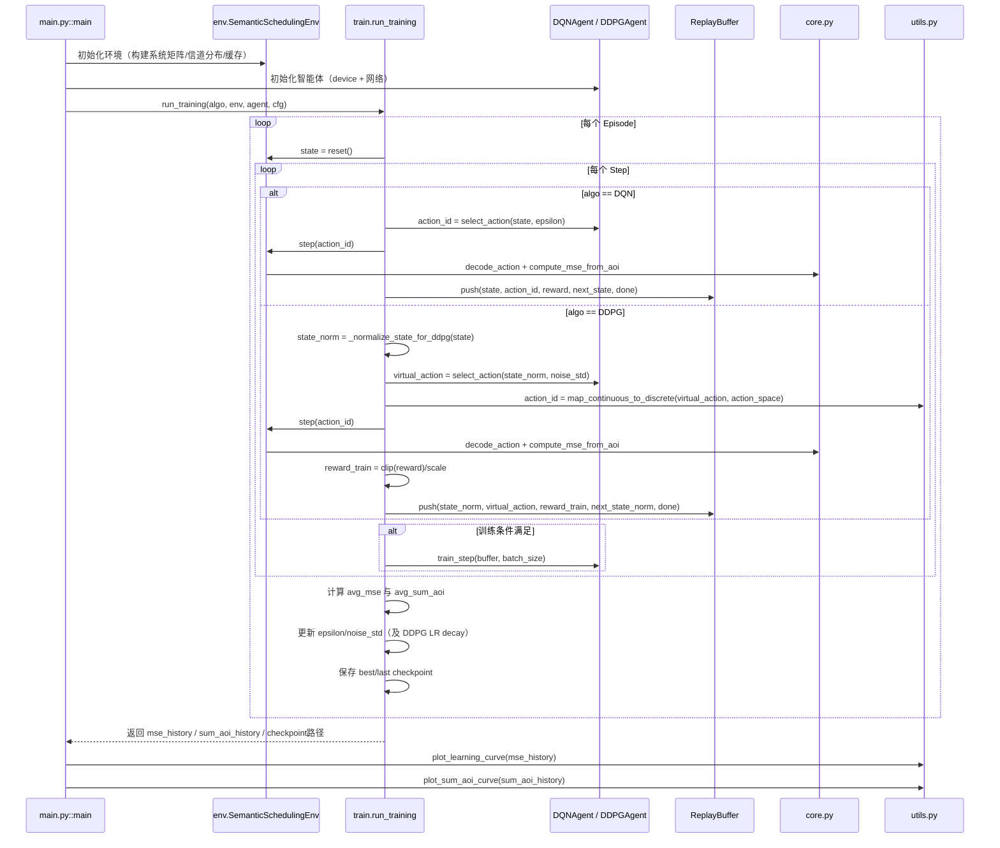
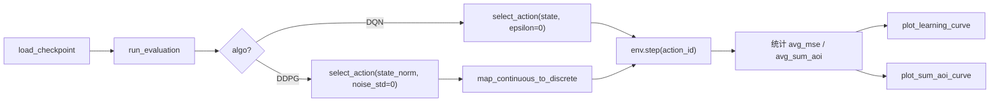

# Remote_Estimation_RL 代码关系图（文件 + 函数 + 数据流）

> 说明
- 本文件基于当前代码自动梳理。
- 采用 Mermaid，可在支持 Mermaid 的编辑器/平台中直接渲染为思维导图/流程图。

## 1) 文件级依赖关系图

## 2) 函数/类关系图（跨文件调用）

```mermaid
flowchart TB
    subgraph MAIN_FILE["main.py"]
        M1["parse_args"]
        M2["set_global_seed"]
        M3["resolve_device"]
        M4["build_train_config"]
        M5["_exp_decay_gamma"]
        M6["main"]
    end

    subgraph ENV_FILE["env.py"]
        E0["SemanticSchedulingEnv.__init__"]
        E1["_build_mse_cache"]
        E2["_build_global_channel_bins"]
        E3["_build_stationary_channel_state_probs"]
        E4["_refresh_channel_states"]
        E5["_build_state"]
        E6["reset"]
        E7["step"]
    end

    subgraph CORE_FILE["core.py"]
        C1["generate_unstable_matrix"]
        C2["solve_steady_state_covariance"]
        C3["compute_mse_from_aoi"]
        C4["generate_action_space"]
        C5["decode_action"]
    end

    subgraph AGENT_FILE["agent.py"]
        A0["ReplayBuffer\n(push/sample/__len__)" ]
        A1["QNetwork"]
        A2["DQNAgent\n(select_action/train_step)"]
        A3["ActorNet"]
        A4["CriticNet"]
        A5["DDPGAgent\n(select_action/train_step/_soft_update\nstep_lr_decay/get_current_lrs)"]
    end

    subgraph TRAIN_FILE["train.py"]
        T1["_normalize_state_for_ddpg"]
        T2["_build_checkpoint"]
        T3["save_checkpoint"]
        T4["load_checkpoint"]
        T5["run_training"]
        T6["run_evaluation"]
    end

    subgraph UTILS_FILE["utils.py"]
        U1["map_continuous_to_discrete"]
        U2["moving_average"]
        U3["plot_learning_curve"]
        U4["plot_sum_aoi_curve"]
    end

    %% main -> 其他模块
    M6 --> M1
    M6 --> M2
    M6 --> M3
    M6 --> M4
    M6 --> M5

    M6 --> E0
    M6 --> A2
    M6 --> A5
    M6 --> T5
    M6 --> T6
    M6 --> T4
    M6 --> U3
    M6 --> U4

    %% env 初始化调用 core
    E0 --> C4
    E0 --> C1
    E0 --> C2
    E0 --> E1
    E0 --> E2
    E0 --> E3
    E0 --> E4

    %% env.step 调用 core
    E7 --> C5
    E7 --> C3
    E7 --> E4
    E6 --> E4
    E6 --> E5
    E7 --> E5

    %% train 调用关系
    T5 --> A0
    T5 --> T1
    T5 --> U1
    T5 --> T3
    T5 --> A2
    T5 --> A5

    T6 --> T1
    T6 --> U1
    T6 --> A2
    T6 --> A5

    T3 --> T2

    %% utils 内部
    U3 --> U2
    U4 --> U2
```

## 3) 训练数据流（run_training 主路径）

## 4) 评估数据流（run_evaluation）

## 5) 状态与动作数据格式总览

- State: `np.ndarray[float32]`, shape=`(N + N*M,)`，当前为 `(24,)`。
- AoI: `np.ndarray[int64]`, shape=`(N,)`。
- H_t（离散信道索引）: `np.ndarray[int64]`, shape=`(N,M)`，元素取值 `0..4`。
- DQN action: `int`（`action_id`）。
- DDPG virtual action: `np.ndarray[float32]`, shape=`(N,)`，范围 `[-1,1]`。
- Env reward: `float = -sum_n Tr(P_n,t)`。
- 训练输出:
  - `mse_history: list[float]`
  - `sum_aoi_history: list[float]`
  - `best_model_path / last_model_path`
  - 
