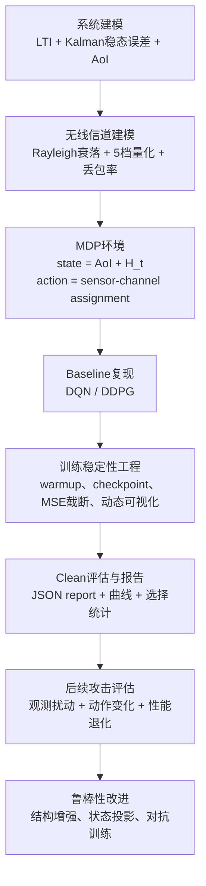

# 网络化远程状态估计调度复现与强化学习脆弱性分析技术文档

## 1. 文档定位

本文档面向硕士论文开题报告撰写，基于当前项目代码与已有实验输出，总结目前完成的复现工作，并规划后续围绕强化学习脆弱性分析与鲁棒性改进展开的三个主要研究工作量。

当前项目以 Chen 等 2024 年关于结构增强深度强化学习的传输调度论文为主要复现对象，研究场景是无线网络化远程状态估计中的传感器调度问题。系统中存在多个不稳定线性动态系统，每个传感器观测本地状态并通过有限无线信道上传信息，远端估计误差由信息年龄（AoI）和信道丢包共同决定。强化学习智能体需要根据 AoI 与信道状态选择传感器-信道分配动作，从而最小化长期远端估计误差。

本文档中的“已完成内容”主要指当前代码已经具备的复现基础；“未来规划”则围绕硕士论文需要形成的三个工作量组织：

1. 网络化远程估计调度问题的基准复现与可扩展实验平台。
2. 面向观测空间的强化学习调度策略脆弱性分析与攻击评估。
3. 面向结构信息与鲁棒训练的防御方法设计和对比验证。

## 2. 当前研究问题与技术路线

### 2.1 研究问题

网络化远程状态估计系统中的调度策略需要同时面对三类困难：

- 系统动态具有不稳定性：每个传感器对应的系统矩阵 \(A_n\) 谱半径大于 1，若长时间不成功传输，远端估计误差会随 AoI 快速增长。
- 无线信道具有随机性：传感器-信道链路质量由瑞利衰落和离散量化信道状态决定，不同链路具有不同丢包概率。
- 调度动作具有组合性：每个时刻需要从 \(N\) 个传感器中选择 \(M\) 个并分配到不同信道，离散动作空间规模为 \(N!/(N-M)!\)，随着系统规模迅速膨胀。

当前代码将上述问题建模为马尔可夫决策过程（MDP）：

- 状态：所有传感器 AoI 向量与传感器-信道状态矩阵的拼接。
- 动作：传感器-信道 assignment，未调度传感器记为 0，被调度传感器分配到信道 1 到 \(M\)。
- 奖励：负的总远端估计误差，即 \(-\sum_n \mathrm{Tr}(P_{n,t})\)。
- 目标：通过 DQN 或 DDPG 学习调度策略，降低平均 Sum MSE 和平均 SumAoI。

### 2.2 总体技术路线

当前项目的技术路线可概括为：



## 3. 已完成的复现基础

### 3.1 系统模型与环境复现

当前项目已经在 `env.py`、`core.py`、`config.py` 中完成了网络化远程状态估计环境的主体复现。

已完成内容包括：

- 为每个传感器生成独立的线性系统矩阵 \(A_n\)，并控制谱半径位于不稳定区间。
- 使用稳态本地 Kalman 误差协方差 \(\bar{P}_n\)，避免在每个 step 重复执行完整 Kalman 滤波。
- 根据 AoI 计算远端估计误差：
  \[
  P_{n,t}=A_n^{\tau_{n,t}}\bar{P}_n(A_n^\top)^{\tau_{n,t}}+\sum_{k=0}^{\tau_{n,t}-1}A_n^kW_n(A_n^\top)^k
  \]
- 对 \(A^k\) 和过程噪声累积项进行预计算缓存，降低训练过程中 MSE 计算开销。
- 构建基于瑞利分布的传感器-信道链路质量矩阵，并将信道状态量化为 5 档。
- 实现 AoI 状态转移：传输成功时 AoI 重置为 1，传输失败或未调度时 AoI 增加并受上限约束。
- 实现总 MSE 截断，当前上限为 `n * TRACE_P_CAP_PER_SENSOR`，用于抑制训练过程中由 AoI 增大导致的指数爆炸。

当前默认系统配置如下：

| 配置项 | 当前设置 | 说明 |
|---|---:|---|
| `base` 场景 | \(N=6, M=3\) | 论文基础规模 |
| `s10x5` 场景 | \(N=10, M=5\) | 中等规模扩展 |
| `s20x10` 场景 | \(N=20, M=10\) | 大规模扩展，主要面向 DDPG |
| 单传感器状态维度 | \(l_n=2\) | 与论文实验设置一致 |
| 单传感器观测维度 | \(e_n=1\) | 与论文实验设置一致 |
| 信道量化等级 | 5 | 对应 5 档丢包率 |
| 丢包率 | `[0.2, 0.15, 0.1, 0.05, 0.01]` | 信道越好丢包率越低 |
| 每个 episode 长度 | 500 | 当前训练和评估默认设置 |
| 默认训练 episode | 300 | 当前 baseline 主要实验长度 |

### 3.2 DQN 与 DDPG baseline 复现

当前项目已经实现了 DQN 和 DDPG 两类 baseline。

DQN 部分已完成：

- 使用离散 action id 表示传感器-信道 assignment。
- 在 `core.py` 中生成完整动作空间，规模为 \(N!/(N-M)!\)。
- 在 `agent.py` 中实现 Q 网络、target Q 网络、epsilon-greedy 探索、经验回放和目标网络更新。
- 在 `train.py` 中支持 DQN 训练、评估、checkpoint 保存与加载。
- 支持 DQN warmup 参数 `--dqn-warmup-steps`，用于先随机采集经验再开始参数更新。

DDPG 部分已完成：

- 使用 Actor 输出长度为 \(N\) 的连续向量。
- 使用 Top-\(M\) 排序将连续动作映射为传感器-信道 assignment。
- DDPG 在大规模场景中不构建完整离散动作空间，而是直接调用 `env.step_assignment()`，避免组合动作空间爆炸。
- 在 `agent.py` 中实现 Actor、Critic、target networks、soft update、学习率衰减和梯度裁剪。
- 支持 DDPG warmup、探索噪声衰减和 best checkpoint 选择。

需要注意的是，当前 DDPG 已具备“连续动作排序后选择 Top-\(M\)”的基本逻辑，但与论文中“排序后将排名线性归一化到 \([-1,1]\) 并作为 virtual action 进入 Critic”的严格定义仍需进一步核对和补齐。这一部分应作为后续复现精化任务，而不是当前已完全完成的结论。

### 3.3 训练编排、场景管理与结果输出

当前项目已经从早期单脚本训练逐步整理为模块化流程：

| 文件 | 当前职责 |
|---|---|
| `config.py` | 全局常量、算法超参数、场景预设 |
| `core.py` | 系统矩阵、稳态协方差、MSE 计算、动作空间 |
| `env.py` | 语义调度 MDP 环境 |
| `agent.py` | DQN/DDPG 网络、经验回放与训练步骤 |
| `train.py` | 训练循环、评估循环、checkpoint 保存加载 |
| `workflow.py` | seed/device/env/agent/config 的编排 |
| `main.py` | CLI 入口、训练/评估模式、绘图和 report 保存 |
| `utils.py` | 动作映射、滑动平均、曲线绘图、动态纵轴 |
| `eval_attack.py` | clean-only 攻击评估入口 |
| `attacks/attack_config.py` | 攻击配置数据结构 |
| `attacks/state_ops.py` | 状态拆分、拼接和合法范围投影 |

当前训练入口支持：

```powershell
python main.py --algo DQN --scenario base --seed 24 --episodes 300 --device cpu
python main.py --algo DDPG --scenario base --seed 24 --episodes 300 --device cpu
python main.py --algo DDPG --scenario s10x5 --seed 21 --episodes 300 --device cpu
```

当前 DQN 只允许 `base` 场景。原因是 DQN 依赖完整离散动作空间，而在 `s10x5` 和 `s20x10` 下动作空间规模会快速增大，不适合作为当前大规模 baseline 的直接实现。DDPG 则通过 assignment 路径支持更大规模场景。

### 3.4 训练稳定性与可视化改进

在复现过程中，项目已经加入多项训练稳定性和结果展示改进：

- AoI 上限：通过 `MAX_AOI` 控制 AoI 最大值。
- MSE 上限：通过 `TRACE_P_CAP_PER_SENSOR` 控制总 MSE 截断，避免少量 episode 的指数爆炸主导曲线。
- DQN warmup：支持在训练前期随机采样经验，并在 warmup 结束后再启动参数更新。
- DDPG warmup：支持前期延迟训练，使 replay buffer 先积累样本。
- best checkpoint：支持按训练指标或 clean-eval 指标选择 best checkpoint。
- 动态纵轴：训练图和 DQN/DDPG 对比图根据收敛段均值动态设置纵轴范围，使大多数有效曲线区域更清晰。
- report 浮点数四位保留：训练报告中的浮点数统一保留 4 位，便于阅读和表格整理。

当前 report 已包含与后续脆弱性分析相关的结构统计：

- `per_channel_selected_sensor_aoi_mean`：每个信道被分配传感器时的平均 AoI。
- `per_sensor_selected_count`：每个传感器在训练期间被选择的次数。
- `per_sensor_avg_aoi_when_selected`：每个传感器被选择时的平均 AoI。
- `sensor_channel_count`：传感器-信道选择计数矩阵，shape 为 \((n,m)\)。
- `per_sensor_spectral_radius`：每个传感器系统矩阵的谱半径，shape 为 \((n)\)。
- `per_channel_scale`：按 sensor 维度平均后的每个信道 scale，shape 为 \((m)\)。

这些统计为后续分析“哪些传感器更关键、哪些信道更常被利用、攻击哪些观测更容易导致调度变化”提供了基础。

### 3.5 Clean attack evaluation 骨架

当前已经搭建 `eval_attack.py` 的第一阶段骨架，功能是只做 clean eval，不加入攻击逻辑。其作用是为后续观测攻击提供统一入口和输出格式。

已完成内容包括：

- 复用 `workflow.build_env()` 和 `workflow.build_agent()` 构建环境与智能体。
- 复用 `train.load_checkpoint()` 加载 checkpoint。
- DQN 评估使用 `epsilon=0` 的贪心策略。
- DDPG 评估使用 `noise_std=0` 的确定性策略。
- 输出 JSON 报告到 `results/attack_reports/`。
- 当前 CLI 保留 `--attack-mode clean`，后续可扩展为具体攻击模式。

示例命令：

```powershell
python eval_attack.py --algo DQN --scenario base --seed 24 --device cpu --eval-episodes 10 --attack-mode clean
python eval_attack.py --algo DDPG --scenario base --seed 24 --device cpu --eval-episodes 10 --attack-mode clean
```

同时，项目已新增攻击模块化的初步基础：

- `attacks/attack_config.py` 定义攻击配置字段。
- `attacks/state_ops.py` 定义状态拆分、拼接、AoI 投影和信道状态投影。
- `tests/test_attack_phase2.py` 对攻击配置和状态操作函数做了基础单元测试。

当前尚未加入实际攻击方法，后续攻击不应继续堆在 `eval_attack.py` 中，而应按模块拆分到 `attacks/` 目录。

## 4. 当前已有实验现象

当前已有实验结果主要用于确认复现流程可以运行，并观察训练稳定性问题。由于尚未完成严格多 seed 统计，下列内容只能作为初步现象，不能直接写成最终论文结论。

### 4.1 训练时间与规模观察

已有报告显示，在 CPU 上进行 300 episode 训练时：

| 算法与场景 | seed | episode | best 指标来源 | best metric | 训练耗时 |
|---|---:|---:|---|---:|---:|
| DQN `base` | 24 | 300 | clean-eval | 82.4390 | 250.5505 s |
| DDPG `base` | 24 | 300 | clean-eval | 82.4222 | 925.5932 s |
| DDPG `s10x5` | 21 | 300 | clean-eval | 160.5513 | 2380.4693 s |

这些结果说明：

- 当前 DQN 在 `base` 场景下训练速度明显快于 DDPG。
- DDPG 支持更大规模场景，但训练耗时显著增加。
- 用户观察到 CUDA 反而更慢是合理现象，因为当前环境交互、MSE 计算、NumPy 逻辑和小型网络训练混合在一起，整体可能不是 GPU 计算瓶颈。

### 4.2 稳定性观察

已有训练曲线和报告反映出以下问题：

- 不同 seed 下训练稳定性差异较大。
- DQN 在某些 seed 后期可能出现发散或性能突变。
- DDPG 在部分训练后期可能出现 MSE 上升或收益退化。
- 因为 \(A_n\) 谱半径大于 1，AoI 增大时 MSE 具有指数增长趋势，少量异常 episode 会显著影响 raw 曲线显示。

因此，当前项目已经引入 AoI/MSE 截断、best checkpoint、动态纵轴等工程措施。但这些措施只解决训练与展示稳定性问题，不能替代正式论文中需要的多 seed 均值、方差和显著性分析。

### 4.3 结果一致性风险

当前报告中存在一个需要后续优先处理的问题：训练报告中的 best metric 与某些 clean attack eval 报告并不完全一致。例如 `DQN base seed24` 的训练报告 best metric 约为 82.4390，但已有 `eval_attack.py` clean 报告中 DQN clean MSE 明显更高。

这说明后续正式实验前必须固定以下流程：

- 每次训练必须保存并记录实际使用的 best checkpoint 路径。
- eval report 必须明确绑定 checkpoint 文件、训练配置和 commit 状态。
- clean eval 应作为所有攻击实验的基线，并保证同一 checkpoint 可重复评估。
- 旧 report 与新 report 要区分，避免把不同版本代码生成的结果混合进论文表格。

## 5. 当前复现与论文目标之间的差距

当前项目已经完成了系统模型、MDP 环境、DQN/DDPG baseline、场景扩展、训练报告和 clean eval 入口，但距离“严格复现论文全部结果”仍有差距。

主要差距包括：

- 论文中的结构增强（SE）三阶段训练尚未完整实现，包括 loose SE、tight SE 和 conventional RL 三阶段切换。
- DDPG virtual action 的严格定义仍需补齐：论文强调 Actor 输出排序后，将对应排名线性归一化到 \([-1,1]\)，并将该 virtual action 与真实调度动作一一映射；当前代码主要使用连续值 Top-\(M\) 排序直接生成 assignment。
- 当前还没有形成正式的 5 seed 均值和方差实验。
- DQN 在大规模场景下尚未支持，当前策略是保留 DQN 为 `base` 对照，DDPG 用于 `s10x5` 和 `s20x10`。
- 当前攻击评估只完成 clean eval 与部分基础模块，尚未实现 random AoI、random H、joint attack 或 targeted attack。
- 当前鲁棒性防御方法尚未正式接入训练和评估流程。

这些差距并不影响开题阶段对技术路线的论证，反而可以自然转化为后续三个研究工作量。

## 6. 硕士论文三个主要工作量规划

### 工作量一：网络化远程估计调度 baseline 复现与可扩展实验平台

#### 研究目标

建立一个可复现、可扩展、可诊断的网络化远程状态估计调度实验平台，用于支持 DQN、DDPG 及后续结构增强方法的横向比较。

#### 具体内容

- 完成系统模型、信道模型、AoI 演化、MSE 奖励函数和调度约束的严格复现。
- 在 `base` 场景下稳定复现 DQN 与 DDPG baseline，并与论文趋势进行对齐。
- 在 `s10x5` 和 `s20x10` 场景下建立 DDPG 可扩展 baseline。
- 补齐 DDPG virtual action 排名归一化逻辑，使 Actor、Critic 与环境映射更接近论文定义。
- 逐步加入或复现 SE 三阶段训练逻辑，分析其是否不仅提升性能，也具有潜在鲁棒性效果。
- 固化实验记录流程，包括 checkpoint、report、history、图像和配置绑定。

#### 预期产出

- 一套可重复运行的 baseline 训练与评估代码。
- `base/s10x5/s20x10` 三种规模下的 DQN/DDPG 或 DDPG 对照结果。
- 平均 Sum MSE、平均 SumAoI、训练耗时、稳定性曲线和选择统计表。
- 对 DQN 在大动作空间下不可扩展或不收敛现象的实验说明。

#### 硕士论文价值

该工作量构成论文的实验平台基础。没有稳定 baseline，后续攻击和防御结果无法可信比较。因此，该部分应在论文中作为“系统建模与基准算法复现”章节展开。

### 工作量二：面向观测空间的强化学习调度脆弱性分析与攻击评估

#### 研究目标

研究强化学习调度策略在观测扰动下的脆弱性，重点关注攻击者不直接修改环境真实状态和动力学，只扰动智能体看到的观测输入，从而诱导错误调度决策。

#### 攻击对象

当前状态向量可以拆分为：

- AoI 段：shape 为 \((n)\)，表示每个传感器的信息年龄。
- 信道状态段：shape 为 \((n,m)\) 展平，表示每个 sensor-channel 链路当前离散信道质量。

后续攻击可以围绕两类语义观测展开：

- AoI 观测攻击：篡改部分传感器 AoI，使智能体误判系统紧急程度。
- 信道观测攻击：篡改部分 sensor-channel 链路质量，使智能体误判传输成功概率。
- 联合观测攻击：同时扰动 AoI 与信道状态，分析组合扰动是否具有更强破坏力。

#### 具体内容

- 在 `attacks/` 目录下模块化实现攻击配置、状态操作、随机语义攻击、动作工具和攻击指标。
- 先实现 random AoI、random H、random joint 等黑盒语义攻击。
- 再考虑 targeted attack，例如优先攻击高谱半径传感器、高选择频率传感器或关键 sensor-channel 链路。
- 对 DQN 与 DDPG 分别评估攻击前后性能变化。
- 分析攻击是否改变被选传感器集合、信道分配关系和最终 MSE/SumAoI。

#### 核心指标

建议后续报告中至少包含：

- clean MSE 与 attacked MSE。
- clean SumAoI 与 attacked SumAoI。
- MSE 退化率：
  \[
  \Delta_\mathrm{MSE}=\frac{\mathrm{MSE}_{attack}-\mathrm{MSE}_{clean}}{\mathrm{MSE}_{clean}}
  \]
- 动作翻转率：攻击前后 assignment 是否不同。
- 被选传感器集合翻转率：攻击前后 Top-\(M\) sensor set 是否不同。
- 信道分配翻转率：攻击前后同一传感器是否被分配到不同信道。
- 按传感器统计的攻击敏感性。
- 按信道或 sensor-channel 统计的攻击敏感性。

#### 预期产出

- 一套 observation attack evaluation 框架。
- 多种攻击强度下 DQN/DDPG 的性能退化曲线。
- 传感器谱半径、信道 scale、选择频率与攻击敏感性之间的相关性分析。
- 对“哪些观测最关键、哪些调度策略最脆弱”的实验解释。

#### 硕士论文价值

该工作量构成论文的主要创新点之一。现有复现论文主要关注调度性能，而本研究进一步讨论深度强化学习调度策略面对观测扰动时的可靠性和安全性问题，能够形成独立的攻击建模与脆弱性分析章节。

### 工作量三：面向鲁棒性的结构增强与防御方法设计

#### 研究目标

在完成攻击评估后，设计简单但有解释性的鲁棒性改进方法，使调度策略在 clean 场景下保持性能，同时在观测攻击下减小性能退化。

#### 可选防御方向

第一类是结构增强防御：

- 补齐论文中的 SE 思想，将系统结构信息或调度结构约束引入训练。
- 分析 SE 是否天然具有鲁棒性趋势，即是否能减少不合理动作或降低策略对局部观测噪声的敏感性。
- 对比 conventional DQN/DDPG 与 SE-DQN/SE-DDPG 在 clean 和 attack 下的表现。

第二类是状态投影与观测净化：

- 对输入观测做合法范围投影，例如 AoI 投影到 \([1,\mathrm{MAX\_AOI}]\)，信道状态投影到离散合法档位。
- 对异常 AoI 或异常信道状态引入简单检测与裁剪。
- 分析这种方法对随机扰动和强语义扰动的防御效果。

第三类是对抗训练或扰动增强：

- 在训练阶段以一定概率加入观测扰动，使策略学习到更平滑的动作边界。
- 控制扰动预算，避免过强扰动破坏 clean 性能。
- 比较 clean-only 训练、随机扰动增强训练和针对性扰动增强训练。

#### 核心比较方式

后续应形成如下对照：

| 策略 | Clean 性能 | Attack 性能 | 性能退化率 | 动作翻转率 | 训练成本 |
|---|---:|---:|---:|---:|---:|
| DQN/DDPG baseline | 需要统计 | 需要统计 | 需要统计 | 需要统计 | 需要统计 |
| SE 或 rank-normalized 策略 | 需要统计 | 需要统计 | 需要统计 | 需要统计 | 需要统计 |
| 状态投影/观测净化 | 需要统计 | 需要统计 | 需要统计 | 需要统计 | 需要统计 |
| 对抗训练策略 | 需要统计 | 需要统计 | 需要统计 | 需要统计 | 需要统计 |

#### 预期产出

- 至少一种可运行的鲁棒训练或鲁棒评估方法。
- clean/attack 双场景下的系统性对比。
- 对鲁棒性提升来源的消融分析。
- 对性能、稳定性和训练成本之间权衡的讨论。

#### 硕士论文价值

该工作量构成论文的第三个主要贡献。它不仅展示“攻击有效”，还进一步回答“如何缓解攻击影响”，使论文从复现和脆弱性分析扩展到方法改进。

## 7. 后续阶段计划

### 近期任务：baseline 固化

- 固定 checkpoint 与 report 的绑定关系。
- 统一 DDPG 训练和评估中的状态归一化策略。
- 补齐 DDPG virtual action 排名归一化逻辑。
- 对 `base` 场景至少完成 DQN/DDPG 若干 seed 的稳定性检查。
- 对 `s10x5` 和 `s20x10` 完成 DDPG baseline 训练流程确认。

### 中期任务：攻击评估框架

- 完成 `attacks/random_semantic.py`，实现 random AoI、random H 和 random joint。
- 完成 `attacks/action_utils.py`，统一 clean action 与 attacked action 的提取。
- 完成 `attacks/metrics.py`，实现 MSE 退化、动作翻转和 sensor/channel 统计。
- 扩展 `eval_attack.py`，但保持主文件只做流程编排，不堆积具体攻击逻辑。
- 输出不同攻击强度下的 JSON report 和汇总表。

### 后期任务：鲁棒性改进与论文实验

- 实现至少一种结构增强或鲁棒训练方法。
- 设计 clean 与 attack 的统一评估表。
- 完成多 seed 均值和方差统计。
- 整理论文图表，包括训练曲线、攻击强度曲线、动作翻转率曲线和 sensor-channel 热力图。
- 对结果进行解释，重点分析高谱半径传感器、高使用频率链路和脆弱动作边界之间的关系。

## 8. 开题报告可写的创新点表述

可以在开题报告中将本课题的创新点表述为以下三点：

1. 构建面向网络化远程状态估计的深度强化学习调度复现实验平台，在不同传感器-信道规模下比较 DQN 与 DDPG 的调度性能、稳定性和可扩展性。
2. 从观测空间安全角度研究强化学习调度策略的脆弱性，设计面向 AoI 与信道状态的语义扰动攻击，并用动作翻转、性能退化和结构统计指标量化攻击影响。
3. 探索结构增强、状态投影和扰动增强训练等鲁棒化方法，分析其在 clean 场景和攻击场景之间的性能权衡，为网络化估计系统中的安全调度提供改进思路。

## 9. 风险与控制措施

| 风险 | 影响 | 控制措施 |
|---|---|---|
| seed 差异导致结论不稳定 | 单次实验可能误导论文结论 | 后续正式结果使用多 seed 均值和方差 |
| DDPG 训练耗时过长 | 限制实验规模和参数搜索 | 优先固定 baseline，再少量关键超参数消融 |
| MSE 指数爆炸影响曲线展示 | 图像不可读，均值被异常值主导 | 保留 raw/log 诊断图，同时使用动态纵轴展示图 |
| checkpoint 与 report 不绑定 | clean/attack 对比不可信 | report 中强制记录 checkpoint path、配置和评估模式 |
| SE 复现复杂度较高 | 影响后续鲁棒性对比 | 先补齐 rank virtual action，再分阶段加入 SE loss |
| 攻击过强导致结果失去解释性 | 无法区分算法脆弱性与非法输入 | 使用合法范围投影和攻击预算分级 |

## 10. 建议的论文结构

后续硕士论文可以按如下结构组织：

1. 绪论：网络化远程估计、强化学习调度和安全鲁棒性研究背景。
2. 系统模型与问题定义：LTI 系统、Kalman 稳态误差、AoI、无线信道和 MDP 建模。
3. 基准算法复现：DQN、DDPG、结构增强思想、训练流程和复现实验。
4. 观测攻击与脆弱性分析：攻击模型、攻击算法、指标体系和实验结果。
5. 鲁棒性改进方法：结构增强、防御机制、对抗训练或状态投影方法。
6. 实验与讨论：多场景、多 seed、攻击强度、消融实验和复杂度分析。
7. 总结与展望：研究结论、局限性和未来工作。

## 11. 当前结论

当前项目已经完成了从系统建模、环境构建、DQN/DDPG baseline、训练评估、结果报告到 clean attack eval 骨架的主体复现基础。现阶段最重要的不是立即扩大 seed 数量，而是先固化 baseline 的正确性和可重复性，尤其是 checkpoint-report 绑定、DDPG virtual action 复现细节、状态归一化一致性和大规模 DDPG 场景流程。

在此基础上，后续论文工作可以自然扩展为三个层次：先完成可信 baseline，再做观测攻击脆弱性分析，最后提出鲁棒性改进方法。这样的组织方式能够满足硕士论文对工程实现、实验分析和方法改进三个方面的工作量要求。
